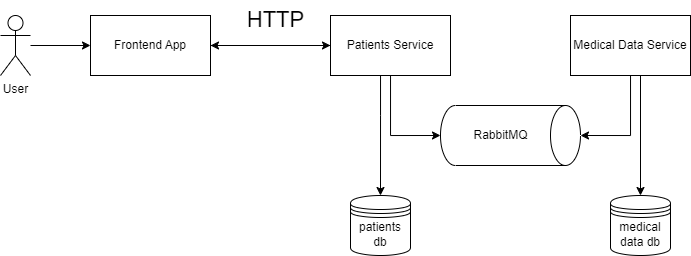

# distributed-transactions
Pet-project to mess around with distributed transactions using .NET Core services.

## Infrastructure:
- Database - postgres
- Service bus - RabbitMQ via MassTransit
- In plans: GRPC instead of pure HTTP.

## Services:
1. **Frontend App** which represents a simple Blazor app that displays data taken from the backend.
2. **Patients Service** - Stores core patients data in the database and returns it to the frontend. Additionally connected to Message Bus to send notifications about new patients into medical data service.
3. **Medical Data Service** - only connected to other services via message bus.

Architecture scheme:
